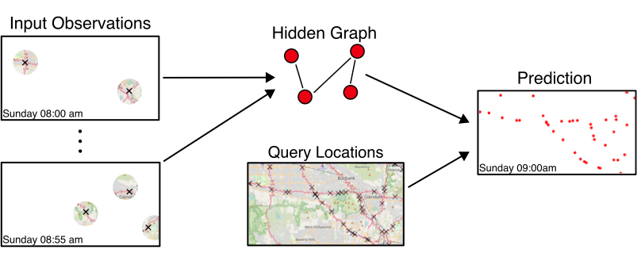
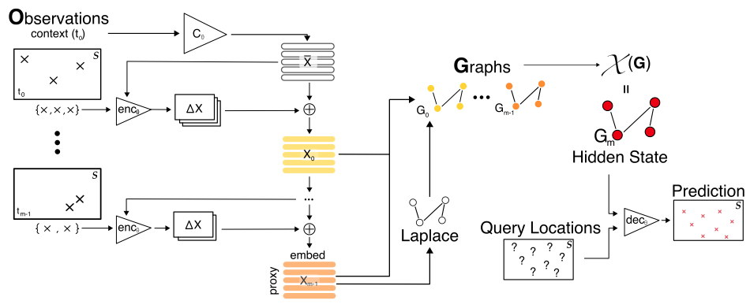
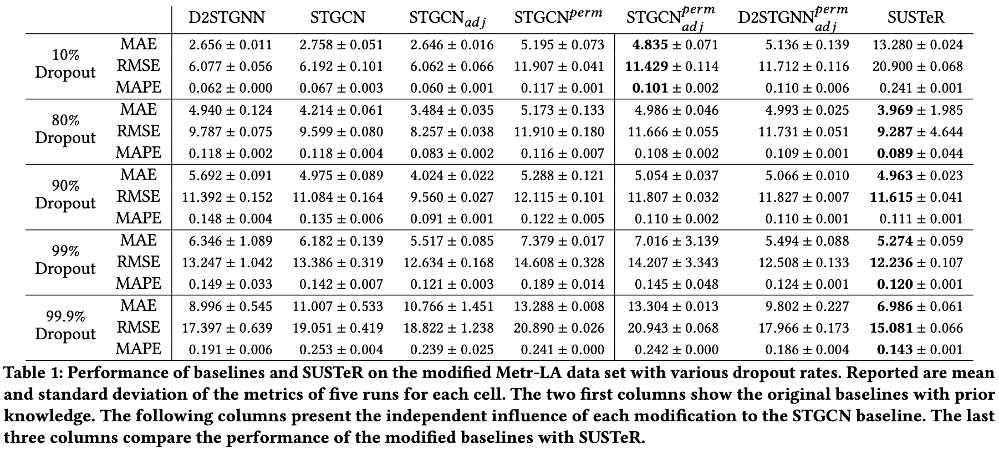

# SUSTeR Sparse Unstructured Spatio Temporal Reconstruction



This repository contains the code to the paper: "SUSTeR: Sparse Unstructured Spatio Temporal Reconstruction on Traffic Prediction" which is currently under review.
SUSTeR is a framework to reconstruct spatio temporal states from very sparse observations.
Thereby sparse is meant in different aspects: spatial, temporal, or training samples wise.
The framework wraps common spatio temporal Graph Neural Networks (STGNN) to enhance their performance with unstructured sparse data.



We test the frameowork on the METR-LA traffic dataset and wrap the popular STGCN algortihm with it. 
The base implementations for the STGCN and the preperation of the data generator are used from the [BasicTS](https://github.com/zezhishao/BasicTS) repository.

## Performance 

In the following table we show the performance of SUSTeR with different dropout rates on the METR-LA database.
The performance is compared with both baselines algorithms STGCN and D2STGNN.
In the first 4 columns we show how our mandatory modifications to these algorithms, to compare them with our framework, affects the performance.
The three right most columns show the performance comparison at the introduced sparse and unstructured traffic reconstruction problem.




In favor of space and explanation we left out in the paper the impact of the modification onto the PEMS-BAY dataset.
For completeness we provide here the same table as with the METR-LA dataset with the PEMS-BAY dataset to better compare the the impact of the modifications and the great results of SUSTeR.


## Usage 

### Dependencies
The follwing packages are required:

* torch        1.10.0+cu111
* tqdm
* scikit-learn 1.1.3
* numpy        1.22.3


### Prepare Data

The raw data is part of this repository in the folder `data/raw` but for the sparse use case described in the SUSTeR paper the nodes need to be dropped with a specified dropout rate.
Therefore we provide a script which drops the amount of sensors given a dropout ratio and saves the new dataset into the `data/METR-LA` folder.

```bash
python scripts/metr-la.py --dropout 0.99
```
This creates a dataset with 99% missing data.

### Run the code 
To train suster on a generated dataset the follwoing command can be used.

```bash
python suster/train.py --epochs 50
```

See the help displayment for the parameters which are documented in the paper.

```
> python suster/train.py --help
    usage: train.py [-h] [--dropout DROPOUT] [--slurmid SLURMID] [--graphnodes GRAPHNODES] [--context CONTEXT] [--factor FACTOR] [--train_percentage TRAIN_PERCENTAGE] [--reps REPS] [--embed_dim EMBED_DIM] [--epochs EPOCHS]

    optional arguments:
    -h, --help            show this help message and exit
    --dropout DROPOUT     The dropout from the created dataset.
    --slurmid SLURMID     Passing a slurm id which will help to identify the learned model.
    --graphnodes GRAPHNODES
                            The number of graph nodes.
    --context CONTEXT     If Xbar is dependent on the context.
    --factor FACTOR       The fraction of neurons that the wrapped STGCN can work with. None is equal is an avergae of the graphs as described in the paper.
    --train_percentage TRAIN_PERCENTAGE
                            Define with how much of the training data SUSTeR will be trained.
    --reps REPS           Number of repetitions
    --embed_dim EMBED_DIM
                            The latent embedding dimension
    --epochs EPOCHS
```
